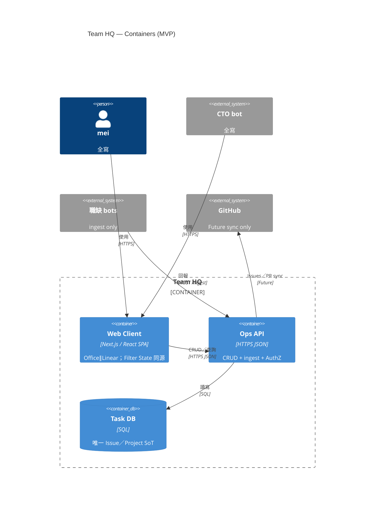
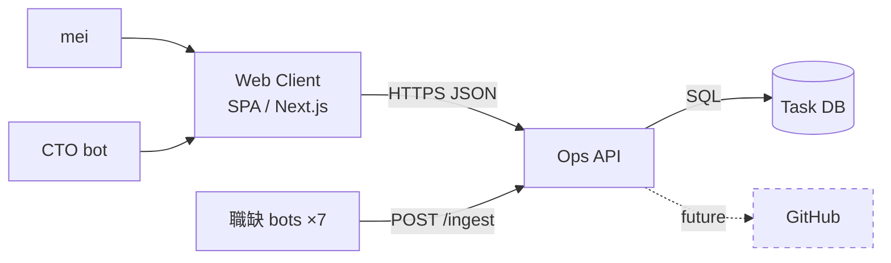

# C4 Container — Team HQ

| 欄位 | 內容 |
|------|------|
| 層級 | C4 Level 2（Containers） |
| 對齊 | PRD v1.3 §12；ADR-001 |
| 日期 | 2026-09-19（Asia/Taipei） |

## 1. 容器一覽

| 容器 | 技術取向 | 責任 |
|------|----------|------|
| **Web Client** | SPA／建議 **Next.js App Router**（或同等 React SPA＋typed API client） | 雙整頁視圖 **View Office** ∥ **View Linear**；共享 Filter State；呼叫 Ops API；不持有任務真相庫 |
| **Ops API** | 獨立後端服務（語言自選；須可測 AuthZ／冪等） | Issues CRUD、權限閘門、`POST /ingest`、審計欄位寫入；**不是** GitHub BFF |
| **Task DB** | 單一關聯式（或同等）資料庫 | Project／Issue／Agent 相關持久化；**唯一**任務 SoT |

未來（非 MVP 容器職責）：

| 連線 | 說明 |
|------|------|
| Ops API → GitHub | Issues／PR sync（Phase 1.1）；需獨立憑證與邊界審查 |

## 2. 連線契約

| From | To | 方式 | 備註 |
|------|-----|------|------|
| Web Client | Ops API | **HTTPS JSON** | 列表／詳情／突變；樂觀更新或 15–30s 輪詢 |
| 職缺 bots | Ops API | **HTTPS `POST /ingest`** | Bot token；assignee-scoped AuthZ |
| Ops API | Task DB | SQL／驅動程式 | 僅 API 持有連線字串（env） |
| Ops API | GitHub | future | MVP 無實作 |
| mei／CTO | Web Client | HTTPS | 瀏覽器 |

### Ingest 最小契約（示意）

```json
{
  "projectSlug": "marketing",
  "assigneeRole": "frontend",
  "title": "完成商品卡 hover 狀態",
  "status": "done",
  "source": "bot_report",
  "sourceRef": "agent:frontend:task-123",
  "blockedReason": null
}
```

冪等鍵：`source` + `sourceRef`。`status=blocked` 時 `blockedReason` 必填（否則 400）。

## 3. 部署邊界（MVP）

| 環境 | 允許 | 禁止 |
|------|------|------|
| 靜態原型 | GitHub Pages／純靜態 **僅** 展示 UI 殼 | 把 Pages 當 API／寫入面 |
| 可驗收／正式 | Web＋Ops API＋DB 同區或同 orchestrator；公開 https 由 CTO 佈 | secrets 寫進 repo；私有 GH deep-link 當功能依賴 |

## 4. Mermaid — C4Container



flowchart 等價：



## 5. 容器內責任切割（防漏）

| 關注點 | Web Client | Ops API | Task DB |
|--------|------------|---------|---------|
| Filter State | 持有／URL 同步／跨視圖保留 | 提供可篩選查詢參數 | 持久化實體，不存 UI filter |
| AuthZ | UX 隱藏不可用操作 | **強制**拒絕越權 | 無業務授權邏輯 |
| 聚合狀態 | 顯示 Agent 主狀態 | 可計算或回傳聚合 | 存 Issue 列；聚合可導出 |
| 即時 | 輪詢／樂觀 UI | 幂等寫入；可選 SSE 後加 | — |

## 6. 非目標（Container 層）

- 第二套「辦公室專用」資料庫
- BFF 直接代理 GitHub Issues 當列表來源（MVP）
- 無 API 的純靜態 CRUD（localStorage 當正式 SoT）
