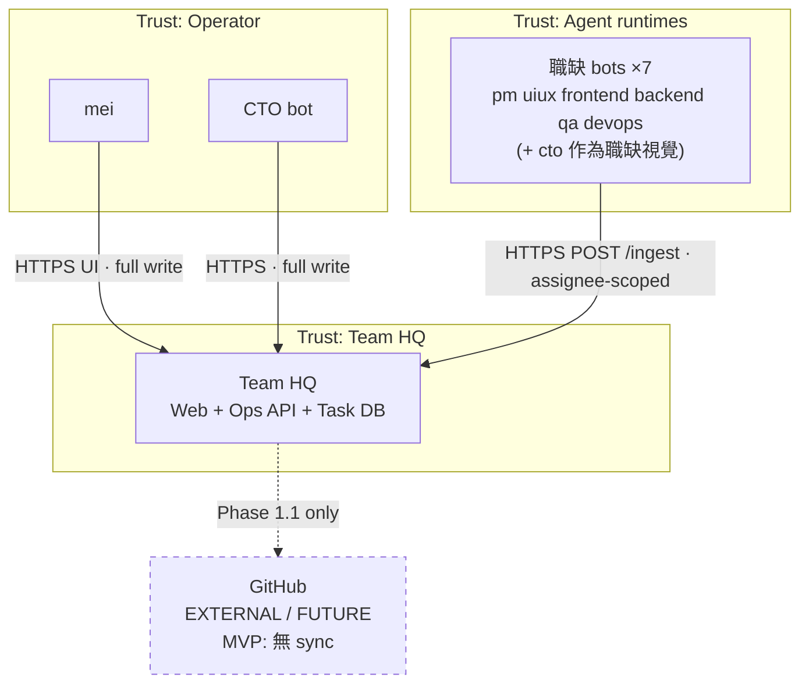

# C4 Context — Team HQ

| 欄位 | 內容 |
|------|------|
| 層級 | C4 Level 1（System Context） |
| 系統 | **Team HQ**（`ts-team-ops-dashboard`） |
| 對齊 | PRD v1.3；IcePanel Context objects |
| 日期 | 2026-09-19（Asia/Taipei） |

## 1. 意圖

描述 **誰** 與 Team HQ 互動、系統外有哪些依賴，以及 **信任邊界**。MVP 內 GitHub **不是** 任務真相來源，僅保留未來連線位。

## 2. 行為者（Actors）

| Actor | 類型 | 責任／動機 |
|-------|------|------------|
| **mei** | Person | 指揮窗口擁有者；掃阻塞、篩選、改狀態／指派；**全任務寫入權** |
| **CTO bot** | Software System（agent） | 拆解／指派／追蹤；與 mei **同權**全寫 |
| **職缺 bots（7）** | Software System（agents） | `cto`／`pm`／`uiux`／`frontend`／`backend`／`qa`／`devops`；經 **ingest** 回報；**僅**可改 `assigneeRole`＝自己的 Issue |

> 說明：辦公室視覺上「CTO」亦為 7 職缺之一；權限上 **CTO bot 與 mei 同屬全寫角色**，其餘 6 職缺 bot 為受限寫入。實作以 token／principal 的角色聲明為準，不以 UI 職缺標籤推斷。

## 3. 系統與外部

| 系統 | 邊界 | MVP 角色 |
|------|------|----------|
| **Team HQ** | 本系統 | 唯一任務作業系統：手動 UI CRUD＋bot ingest；Office∥Linear 同源 |
| **GitHub** | External／**Future** | MVP **無** Issues／PR 同步；專案顯示名來自設定檔（含私有 repo 名稱）。Phase 1.1 才考慮 sync |

## 4. 信任邊界（Trust Boundaries）

```
┌──────────────────────────────── trust: human / operator ────────────────────────────────┐
│  mei（瀏覽器） · CTO bot（經 UI 或同等 privileged principal）                              │
└───────────────────────────────────────────┬─────────────────────────────────────────────┘
                                            │ HTTPS（session／token）
┌──────────────────────────────── trust: Team HQ ─────────────────────────────────────────┐
│                          Team HQ（Web Client + Ops API + Task DB）                         │
│  AuthZ 閘門：full-write（mei｜CTO） vs assignee-scoped（role bots）                         │
└───────────────────────────────────────────┬─────────────────────────────────────────────┘
                                            │ HTTPS POST /ingest（bot token）
┌──────────────────────────────── trust: agent runtime ───────────────────────────────────┐
│  7 職缺 bots（各自 runtime／對話管線）— 不可直連 Task DB；不可持有 DB 憑證                   │
└─────────────────────────────────────────────────────────────────────────────────────────┘

  ····· future / untrusted for MVP SoT ·····
  GitHub.com（含私有 repo）— 無 sync、無 deep-link 假設、無 secrets 交換
```

強制：

- Bots **不得** 直寫 DB；唯一機器寫入面為 Ops API `POST /ingest`（及未來同等閘道）。
- 人類寫入面為 Web → Ops API CRUD；權限在 API 強制，不依賴前端隱藏按鈕。
- GitHub 在 MVP 位於 **信任邊界之外**（無 OAuth app、無 webhook、無 PAT 進 repo）。

## 5. Mermaid — C4Context

```mermaid
C4Context
    title Team HQ — System Context (PRD v1.3 / MVP)

    Person(mei, "mei", "指揮窗口擁有者；全任務寫入")
    System_Ext(cto_bot, "CTO bot", "拆解／指派；與 mei 同權")
    System_Ext(role_bots, "職缺 bots ×7", "僅改自己 assigneeRole；走 ingest")

    System(team_hq, "Team HQ", "ts-team-ops-dashboard：Office∥Linear、Issues CRUD、ingest")

    System_Ext(github, "GitHub", "Future：Issues／PR sync；MVP 僅設定檔顯示名")

    Rel(mei, team_hq, "掃阻塞／篩選／改狀態", "HTTPS UI")
    Rel(cto_bot, team_hq, "全寫任務（UI 或 privileged API）", "HTTPS")
    Rel(role_bots, team_hq, "回報狀態／blockedReason", "HTTPS POST /ingest")
    Rel_Future(team_hq, github, "同步 Issues／PR（非 MVP）", "API／webhook")
```

若渲染器不支援 `C4Context`／`Rel_Future`，使用下列 flowchart 等價圖：



## 6. 互動摘要

| From | To | 協議／資料 | MVP |
|------|-----|------------|-----|
| mei／CTO | Team HQ UI | 瀏覽器 session／token；JSON CRUD | ✓ |
| 職缺 bots | Ops API | `POST /ingest`；冪等鍵 `source`＋`sourceRef` | ✓ |
| Team HQ | GitHub | — | ✗（future） |

## 7. 非目標（Context 層）

- 多租戶／組織隔離
- 將 GitHub Issues 當 SoT
- Bots 旁路 API 直連 DB
- 公開匿名寫入
